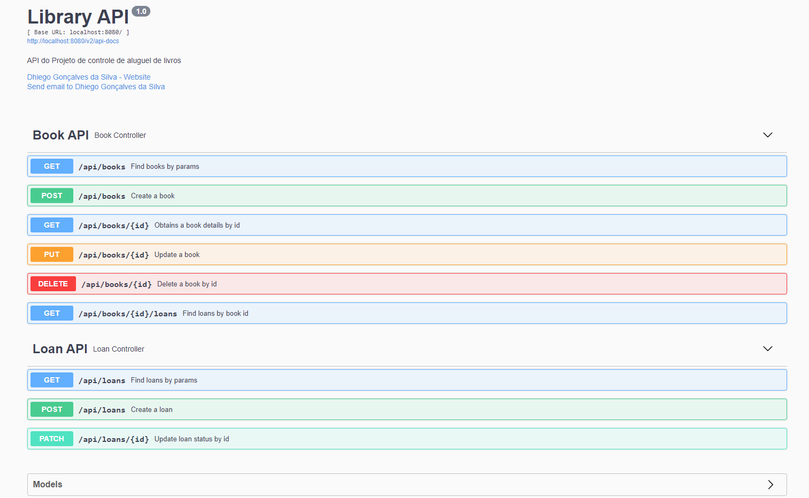

# LIBRARY-API

> Projeto de controle de aluguel de livros desenvolvido com Spring Boot utilizando a metodologia TDD.

- http://localhost:8080/swagger-ui/

    

## Spring Boot Admin

> Projeto que monitora a API.

- http://localhost:8081 > username: admin, password: admin
